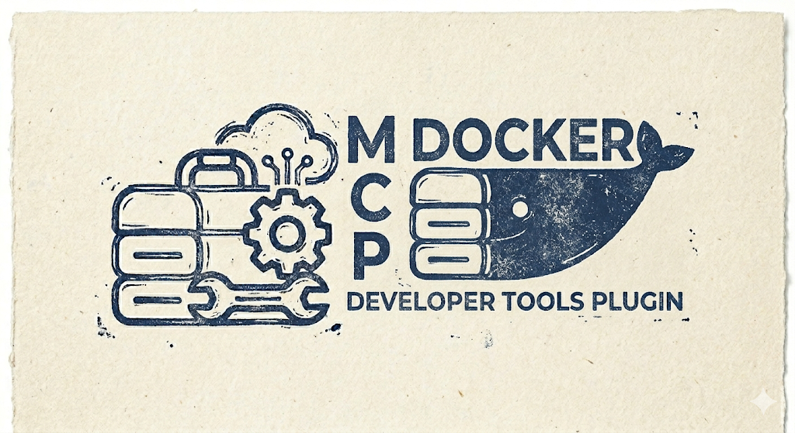
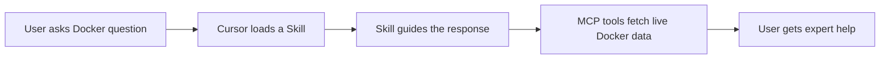

<p align="center">
  
</p>

<h1 align="center">Docker Developer Tools</h1>

<p align="center">
  <em>Expert Docker workflows, directly inside Cursor.</em>
</p>

<p align="center">
  <a href="https://github.com/TMHSDigital/Docker-Developer-Tools/actions/workflows/validate.yml"></a>
  <a href="LICENSE"></a>
  
  <a href="https://www.npmjs.com/package/@tmhs/docker-mcp"></a>
  <a href="https://www.npmjs.com/package/@tmhs/docker-mcp"></a>
  <a href="https://www.npmjs.com/package/@tmhs/docker-mcp"></a>
  <a href="https://github.com/TMHSDigital/Docker-Developer-Tools/stargazers"></a>
  
  
  
</p>

<p align="center">
  <strong>14 skills</strong>&nbsp;&bull;&nbsp;<strong>8 rules</strong>&nbsp;&bull;&nbsp;<strong>68 MCP tools</strong>
</p>

---

## Quick Start

Install the plugin, then ask Cursor anything about Docker:

```text
"Write a production Dockerfile for my Node.js app with multi-stage builds"
"My container keeps restarting - help me debug it"
"Set up a docker-compose stack with Postgres, Redis, and my API"
```

## How It Works



---

<details>
<summary><strong>14 Skills</strong> - on-demand Docker expertise</summary>

&nbsp;

| Category | Skill | Description |
|---|---|---|
| **Core** | `dockerfile-best-practices` | Multi-stage builds, layer caching, base image selection |
| **Core** | `docker-compose-helper` | Service definitions, networking, volumes, environment config |
| **Core** | `docker-troubleshooting` | Diagnose crashes, restarts, network failures, and permission issues |
| **Optimization** | `image-optimization` | Reduce image size, speed up builds, minimize attack surface |
| **Optimization** | `docker-resource-management` | CPU/memory limits, resource monitoring, OOM prevention |
| **Networking & Storage** | `docker-networking` | Bridge, overlay, host networking, DNS resolution, port mapping |
| **Networking & Storage** | `docker-volumes` | Named volumes, bind mounts, tmpfs, backup and restore strategies |
| **Security** | `docker-security` | Image scanning, rootless containers, secrets management, hardening |
| **DevOps** | `docker-ci-cd` | GitHub Actions, GitLab CI, build caching, registry push workflows |
| **DevOps** | `docker-registry` | Private registries, image tagging strategies, cleanup policies |
| **DevOps** | `docker-development-env` | Dev containers, hot reload, debugger attachment, local stacks |
| **Debugging** | `container-debugging` | Exec into containers, log analysis, health checks, process inspection |
| **Advanced** | `docker-advanced-workflows` | Multi-stage pipelines, sidecar patterns, healthchecks, signal handling |
| **Advanced** | `docker-multi-platform` | Multi-arch builds, buildx configuration, manifest lists, platform targeting |

</details>

<details>
<summary><strong>8 Rules</strong> - automatic best-practice enforcement</summary>

&nbsp;

| Rule | Scope | What It Does |
|---|---|---|
| `dockerfile-lint` | `**/Dockerfile*` | Flag antipatterns - unpinned bases, root user, ADD misuse, missing cleanup |
| `docker-secrets` | Global (always active) | Flag hardcoded passwords, tokens, and registry credentials |
| `compose-validation` | Compose files | Flag missing healthchecks, privileged mode, host networking |
| `docker-resource-limits` | Docker-related files | Flag missing memory and CPU limits |
| `docker-image-pinning` | Dockerfiles, compose files | Flag unpinned image tags (`:latest` or no tag) |
| `docker-port-conflicts` | Dockerfiles, compose files | Flag commonly conflicting port mappings |
| `docker-logging` | Dockerfiles, compose files | Flag missing logging drivers and log rotation |
| `buildx-best-practices` | Dockerfiles, compose files | Flag multi-platform build issues, missing cache config, arch hardcoding |

</details>

---

## Companion: Docker MCP Server

The MCP server gives Cursor live access to your local Docker environment.

<p>
  <a href="https://www.npmjs.com/package/@tmhs/docker-mcp"></a>
  <a href="https://www.npmjs.com/package/@tmhs/docker-mcp"></a>
</p>

Add to your Cursor MCP config (`.cursor/mcp.json`):

```json
{
  "mcpServers": {
    "docker": {
      "command": "node",
      "args": ["./mcp-server/dist/index.js"],
      "cwd": "<path-to>/Docker-Developer-Tools"
    }
  }
}
```

<details>
<summary><strong>68 MCP Tools</strong> - full tool reference</summary>

&nbsp;

**Read / Inspect** (10)

| Tool | What It Does |
|---|---|
| `docker_listContainers` | List running and stopped containers with status, ports, and names |
| `docker_inspectContainer` | Get detailed config, state, and networking for a specific container |
| `docker_containerLogs` | Retrieve stdout/stderr logs with optional tail and timestamp filters |
| `docker_listImages` | List local images with tags, sizes, and creation dates |
| `docker_inspectImage` | Get layer history, environment variables, and labels for an image |
| `docker_listVolumes` | List Docker volumes with driver and mount point info |
| `docker_listNetworks` | List Docker networks with driver, scope, and connected containers |
| `docker_diskUsage` | Show disk space used by images, containers, volumes, and build cache |
| `docker_systemInfo` | Return Docker daemon version, OS, storage driver, and runtime info |
| `docker_searchHub` | Search Docker Hub for images by name with filtering options |

**Container Lifecycle** (10)

| Tool | What It Does |
|---|---|
| `docker_run` | Create and start a container from an image (ports, env, volumes, network) |
| `docker_create` | Create a container without starting it |
| `docker_start` | Start a stopped container |
| `docker_stop` | Stop a running container with optional grace period |
| `docker_restart` | Restart a container with optional grace period |
| `docker_kill` | Send a signal to a running container (default: SIGKILL) |
| `docker_rm` | Remove a container (with optional force and volume removal) |
| `docker_pause` | Pause all processes in a running container |
| `docker_unpause` | Unpause a paused container |
| `docker_exec` | Execute a command in a running container |

**Image and Build** (8)

| Tool | What It Does |
|---|---|
| `docker_pull` | Pull an image or repository from a registry |
| `docker_push` | Push an image or repository to a registry |
| `docker_build` | Build an image from a Dockerfile and context directory |
| `docker_tag` | Create a tag that refers to a source image |
| `docker_rmi` | Remove one or more images |
| `docker_commit` | Create a new image from a container's changes |
| `docker_save` | Save one or more images to a tar archive |
| `docker_load` | Load images from a tar archive |

**Compose** (8)

| Tool | What It Does |
|---|---|
| `docker_composeUp` | Create and start Compose services (detached, build, profiles) |
| `docker_composeDown` | Stop and remove containers, networks, volumes, and images |
| `docker_composePs` | List containers for a Compose project |
| `docker_composeLogs` | View logs for Compose services |
| `docker_composeBuild` | Build or rebuild Compose service images |
| `docker_composeRestart` | Restart Compose services |
| `docker_composePull` | Pull images for Compose services |
| `docker_composeExec` | Execute a command in a running Compose service container |

**Volume Management** (4)

| Tool | What It Does |
|---|---|
| `docker_volumeCreate` | Create a named volume with optional driver and labels |
| `docker_volumeRm` | Remove one or more volumes |
| `docker_volumeInspect` | Display detailed volume information |
| `docker_volumePrune` | Remove all unused volumes |

**Network Management** (6)

| Tool | What It Does |
|---|---|
| `docker_networkCreate` | Create a network (bridge, overlay, macvlan) |
| `docker_networkRm` | Remove one or more networks |
| `docker_networkConnect` | Connect a container to a network |
| `docker_networkDisconnect` | Disconnect a container from a network |
| `docker_networkInspect` | Display detailed network information |
| `docker_networkPrune` | Remove all unused networks |

**Cleanup / Prune** (3)

| Tool | What It Does |
|---|---|
| `docker_systemPrune` | Remove unused containers, networks, images, and optionally volumes |
| `docker_containerPrune` | Remove all stopped containers |
| `docker_imagePrune` | Remove dangling or unused images |

**Advanced / Observability** (6)

| Tool | What It Does |
|---|---|
| `docker_cp` | Copy files or directories between a container and the local filesystem |
| `docker_stats` | Show live resource usage statistics (CPU, memory, network I/O) |
| `docker_top` | Show running processes in a container |
| `docker_events` | Stream real-time events from the Docker daemon |
| `docker_update` | Update container resource configuration (CPU, memory, restart policy) |
| `docker_wait` | Block until a container stops and return its exit code |

**Buildx** (8)

| Tool | What It Does |
|---|---|
| `docker_buildxBuild` | Multi-platform builds with buildx (cache export, provenance, push/load) |
| `docker_buildxLs` | List buildx builder instances |
| `docker_buildxCreate` | Create a new buildx builder instance |
| `docker_buildxRm` | Remove a buildx builder instance |
| `docker_buildxInspect` | Inspect a buildx builder instance |
| `docker_buildxUse` | Set the default buildx builder |
| `docker_buildxImagetools` | Inspect or create multi-platform manifest lists via buildx |
| `docker_builderPrune` | Remove buildx build cache |

**Manifest** (5)

| Tool | What It Does |
|---|---|
| `docker_manifestCreate` | Create a local manifest list for multi-architecture images |
| `docker_manifestInspect` | Display an image manifest or manifest list |
| `docker_manifestAnnotate` | Add platform information to a manifest list entry |
| `docker_manifestPush` | Push a manifest list to a registry |
| `docker_manifestRm` | Remove local manifest lists |

</details>

---

<details>
<summary><strong>Installation</strong></summary>

&nbsp;

### Plugin

Symlink this repo into your Cursor plugins directory:

```powershell
# Windows (PowerShell - run as admin)
New-Item -ItemType SymbolicLink `
  -Path "$env:USERPROFILE\.cursor\plugins\docker-developer-tools" `
  -Target "<path-to>\Docker-Developer-Tools"
```

```bash
# macOS / Linux
ln -s /path/to/Docker-Developer-Tools ~/.cursor/plugins/docker-developer-tools
```

### MCP Server

```bash
cd mcp-server
npm install
npm run build
```

Then add the JSON config from the [MCP Server section](#companion-docker-mcp-server) to `.cursor/mcp.json`.

</details>

<details>
<summary><strong>Example Prompts</strong> - one per skill</summary>

&nbsp;

| Skill | Try This |
|---|---|
| `dockerfile-best-practices` | "Write a production Dockerfile for a Python Flask app" |
| `docker-compose-helper` | "Create a compose file with Nginx, Rails, Postgres, and Redis" |
| `docker-troubleshooting` | "My container exits with code 137 - what's wrong?" |
| `image-optimization` | "My Node image is 1.2 GB - help me shrink it" |
| `docker-resource-management` | "Set memory and CPU limits for my compose services" |
| `docker-networking` | "Two containers can't talk to each other - fix my networking" |
| `docker-volumes` | "Back up my Postgres data volume to a tar archive" |
| `docker-security` | "Audit my Dockerfile for security issues" |
| `docker-ci-cd` | "Build and push my image in GitHub Actions with layer caching" |
| `docker-registry` | "Set up a private registry with authentication" |
| `docker-development-env` | "Create a dev container with hot reload for my Go project" |
| `container-debugging` | "Show me the logs and processes inside my crashing container" |
| `docker-advanced-workflows` | "Set up healthchecks and graceful shutdown for my Node.js container" |
| `docker-multi-platform` | "Build my Go API image for both amd64 and arm64 with buildx" |

</details>

<details>
<summary><strong>Roadmap</strong></summary>

&nbsp;

| Version | Theme | MCP Tools | Highlights |
|---|---|---|---|
| **v0.1.0** | Foundation | 10 | 12 skills, 6 rules, 10 read-only MCP tools |
| **v0.2.0** | Container Lifecycle | +10 | run, start, stop, restart, kill, rm, exec, pause |
| **v0.3.0** | Image and Build | +8 | pull, push, build, tag, rmi, commit, save, load |
| **v0.4.0** | Compose | +8 | up, down, ps, logs, build, restart, pull, exec |
| **v0.5.0** | Volumes, Networks, Cleanup | +12 | volume/network CRUD, system/container/image prune |
| **v0.6.0** | Advanced and Observability | +6 | cp, stats, top, events, update, wait |
| **v0.7.0** | Buildx, Manifests, Registry | +13 | Buildx tools, manifest lists, builder management |
| **v0.8.0** | Compose Completeness | +16 | All remaining compose commands (config, cp, kill, scale, etc.) |
| **v0.9.0** | Container/Image Gaps, Context, Auth | +14 | diff, export, port, rename, history, import, contexts, login |
| **v0.10.0** | Swarm Orchestration | +24 | Swarm init/join, services, nodes, scaling, rollback |
| **v0.11.0** | Swarm Stacks, Configs, Secrets, Trust | +18 | Stack deploy, config/secret CRUD, content trust |
| **v0.12.0** | Niche, Scout, Extras | +10 | Version info, Scout CVEs, plugins, compose watch |
| **v1.0.0** | Stable | +0 | Production release (~150 MCP tools) |

</details>

---

## Contributing

Contributions welcome - see [CONTRIBUTING.md](CONTRIBUTING.md). Found a bug? [Open an issue](https://github.com/TMHSDigital/Docker-Developer-Tools/issues).

## License

**CC-BY-NC-ND-4.0** - Copyright 2026 TM Hospitality Strategies. See [LICENSE](LICENSE).

<p align="center">
  Built by <a href="https://github.com/TMHSDigital">TMHSDigital</a>
</p>
