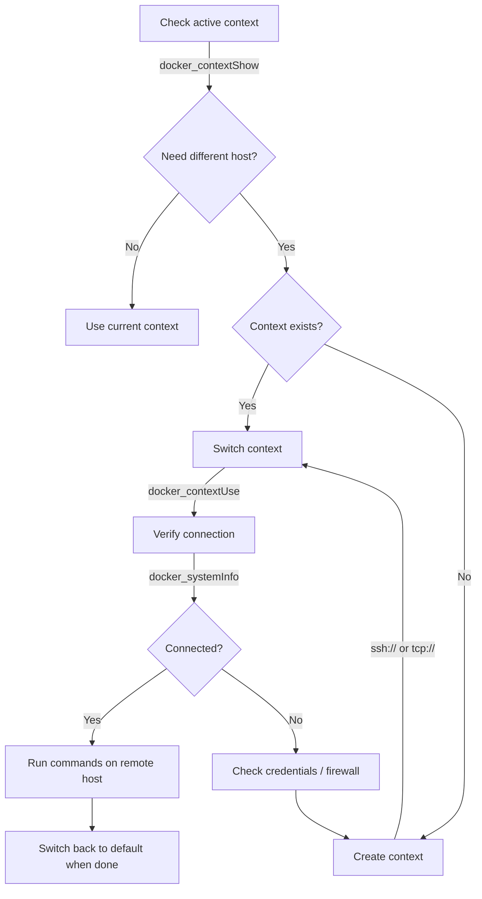

# Docker Context Management

Manage Docker contexts to connect to remote Docker hosts, switch between environments (dev/staging/prod), and orchestrate multi-host workflows.

## Workflow Diagram

## Trigger

Activate when the user:
- Asks about connecting to a remote Docker host
- Wants to manage multiple Docker environments
- Needs to set up SSH or TLS-based Docker access
- Asks about switching between Docker contexts
- Mentions "docker context", "remote Docker", or "multi-host"

## Required Inputs

- **Task type**: create, list, switch, inspect, or remove contexts
- **Connection details** (for create): endpoint URI (ssh:// or tcp://), credentials if applicable

## Workflow

1. **Assess current state** - Use `docker_contextShow` to check the active context and `docker_contextLs` to see all configured contexts.
2. **Identify the target** - Determine which remote host or environment the user needs to connect to.
3. **Create or switch** - Use `docker_contextCreate` to add a new context or `docker_contextUse` to switch to an existing one.
4. **Verify connectivity** - After switching, run `docker_systemInfo` or `docker_listContainers` to confirm the connection works.
5. **Clean up** - Remove unused contexts with `docker_contextRm` to keep the configuration tidy.

## Key References

- Docker CLI: `docker context create`, `docker context ls`, `docker context inspect`, `docker context use`, `docker context show`, `docker context rm`
- Docker endpoint formats: `ssh://user@hostname`, `tcp://hostname:2376`, `unix:///var/run/docker.sock`
- TLS verification: requires ca.pem, cert.pem, key.pem in `~/.docker/contexts/`

## Example Interaction

**User**: "I need to deploy to our staging server at staging.example.com"

**Assistant**: First, let me check your current Docker contexts.
- Calls `docker_contextLs` to list existing contexts
- If no staging context exists, calls `docker_contextCreate` with `ssh://deploy@staging.example.com`
- Calls `docker_contextUse` to switch to the new staging context
- Calls `docker_systemInfo` to verify the connection
- Proceeds with deployment commands targeting the remote host

## MCP Usage

| Tool | When to Use |
|------|-------------|
| `docker_contextCreate` | Setting up a new remote Docker host connection |
| `docker_contextLs` | Listing all configured contexts and their endpoints |
| `docker_contextInspect` | Viewing detailed context configuration (TLS certs, endpoint) |
| `docker_contextRm` | Removing outdated or unused contexts |
| `docker_contextUse` | Switching the active Docker context |
| `docker_contextShow` | Checking which context is currently active |
| `docker_login` | Authenticating to a registry on the remote host |
| `docker_logout` | Logging out from a registry |

## Common Pitfalls

1. **SSH key not configured** - `ssh://` contexts require key-based auth or ssh-agent. Password prompts will hang in non-interactive MCP calls.
2. **TLS certificate mismatch** - When using `tcp://` with TLS, ensure the host certificate matches the endpoint hostname.
3. **Forgetting to switch back** - After deploying to a remote context, switch back to `default` to avoid accidentally running commands on the remote host.
4. **Context in use** - Cannot remove the active context. Switch to another context first with `docker_contextUse`.
5. **Firewall blocking** - TCP endpoints (port 2376) require the port to be open. SSH endpoints (port 22) are typically more accessible.

## See Also

- `docker-security` skill - for TLS and credential best practices
- `docker-ci-cd` skill - for using contexts in CI/CD pipelines
- `docker-secrets` rule - ensure registry credentials are not hardcoded
