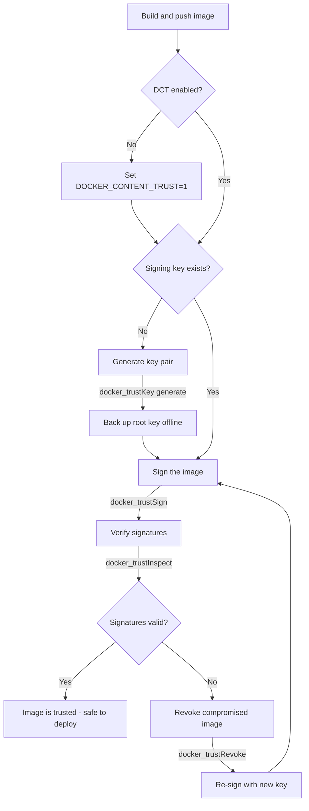

# Docker Content Trust and Image Signing

Enable, manage, and enforce Docker Content Trust (DCT) for image signing and verification across development and CI/CD workflows.

## Workflow Diagram

## Trigger

Activate when the user:
- Asks about Docker Content Trust or image signing
- Wants to sign, verify, or revoke trust for Docker images
- Needs to manage signing keys (generate, load, rotate)
- Mentions "DCT", "notary", "image verification", or "content trust"
- Asks about enforcing signed images in production

## Required Inputs

- **Task type**: enable DCT, sign images, verify signatures, manage keys, or configure CI/CD signing
- **Image details**: registry, repository, and tag for signing/verification
- **Key management**: whether to generate new keys or load existing ones

## Workflow

1. **Check DCT status** - Verify if `DOCKER_CONTENT_TRUST` is enabled in the environment.
2. **Inspect existing trust** - Use `docker_trustInspect` to view current signers and signatures for an image.
3. **Generate or load keys** - Use `docker_trustKey` to generate a new signing key pair or load an existing private key.
4. **Sign images** - Use `docker_trustSign` to sign images after pushing to a registry.
5. **Verify on pull** - With DCT enabled (`DOCKER_CONTENT_TRUST=1`), pulls automatically verify signatures.
6. **Revoke if compromised** - Use `docker_trustRevoke` to remove trust data for a compromised image.

## Key References

- Environment variable: `DOCKER_CONTENT_TRUST=1` enables enforcement globally
- Default notary server: `https://notary.docker.io` (Docker Hub)
- Key storage: `~/.docker/trust/` on the signing machine
- Root key: generated once, used to create repository signing keys - keep offline
- Repository key: per-repo signing key delegated from the root key
- Delegation keys: allow teams to sign without sharing the root key

## Example Interaction

**User**: "Set up image signing for our CI/CD pipeline"

**Assistant**: Walks through the complete setup:
- Calls `docker_trustKey` with action `generate` to create a signing key
- Explains how to set `DOCKER_CONTENT_TRUST=1` in CI environment
- Shows how to sign images after build with `docker_trustSign`
- Calls `docker_trustInspect` to verify signatures are in place
- Recommends key rotation schedule and backup strategy

## MCP Usage

| Tool | When to Use |
|------|-------------|
| `docker_trustInspect` | Viewing signers, signatures, and trust data for an image |
| `docker_trustSign` | Signing an image for Docker Content Trust |
| `docker_trustRevoke` | Revoking trust for a compromised or deprecated image |
| `docker_trustKey` | Generating new signing keys or loading existing keys |

## Common Pitfalls

1. **Root key loss** - The root key cannot be recovered. Back it up immediately after generation and store offline (USB, HSM). Without it, you cannot create new repository keys.
2. **Forgetting to enable DCT** - Setting `DOCKER_CONTENT_TRUST=1` only affects the current shell session. For CI/CD, set it in the pipeline configuration, not interactively.
3. **Signing unsigned tags** - DCT operates on tags, not digests. Pulling by digest bypasses trust verification entirely.
4. **Key passphrase in CI** - Automated signing requires `DOCKER_CONTENT_TRUST_REPOSITORY_PASSPHRASE` environment variable. Never hardcode it - use CI secrets.
5. **Mixed trust enforcement** - If DCT is enabled but some base images are unsigned, builds will fail on `FROM` instructions. Pin base images to signed tags or use `--disable-content-trust` selectively.
6. **Notary server mismatch** - Private registries need their own notary server. Set `DOCKER_CONTENT_TRUST_SERVER` to point to the correct endpoint.

## See Also

- `docker-security` skill - for general container security hardening
- `docker-registry` skill - for registry workflows and authentication
- `docker-swarm` skill - Swarm services can enforce signed images with `--with-registry-auth`
- `swarm-security` rule - automated checks for Swarm security issues
